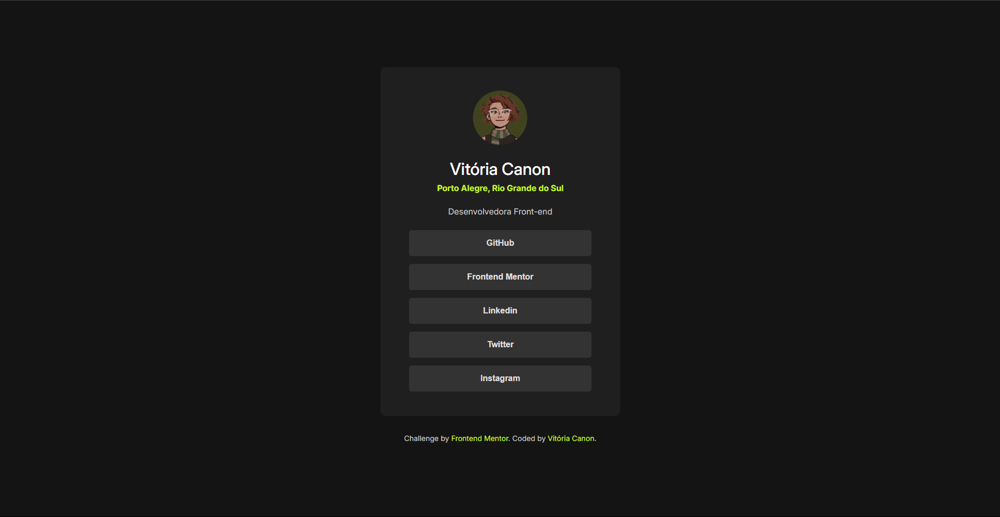

# Perfil de Links Sociais

## Visão Geral

Este projeto é um desafio do [Frontend Mentor](https://www.frontendmentor.io) que visa construir uma página de perfil com links sociais, replicando um design fornecido. O objetivo principal é praticar habilidades de HTML e CSS, com foco em responsividade e interatividade dos elementos.

### O Desafio

O desafio consistiu em construir uma página de perfil de links sociais o mais próximo possível do design. O projeto exige a implementação de estados de `hover` (quando o mouse passa por cima) e `focus` (quando o elemento está selecionado) para todos os elementos interativos, garantindo uma experiência de usuário aprimorada.

### Captura de Tela

### Links

-   URL da Solução: [Em breve]
-   URL do Site Ativo: [Em breve]

## Meu Processo

### Construído com

-   **HTML5 Semântico**: Utilização de tags HTML com significado para estruturar o conteúdo.
-   **CSS Personalizado**: Estilização da página usando propriedades CSS para replicar o design.
-   **Flexbox**: Para layouts flexíveis e responsivos.
-   **Google Fonts**: A fonte "Inter" foi importada para o projeto.

### O que eu aprendi

Durante o desenvolvimento deste projeto, reforcei os seguintes conceitos:

-   **Estrutura de Componentes**: Organizar o HTML em seções lógicas para facilitar a estilização e manutenção.
-   **Propriedades CSS Customizadas (Variáveis CSS)**: Utilização de `:root` para definir variáveis CSS para cores e fontes, tornando o código mais limpo e fácil de gerenciar.
-   **Estilização de Botões e Links**: Aplicar estilos de `hover` e `focus` em elementos interativos para melhorar a usabilidade.
-   **Centralização de Elementos**: Uso de `display: flex`, `align-items: center` e `justify-content: center` para centralizar o conteúdo na página.
-   **Links em Botões**: A melhor prática para adicionar links em botões, mantendo a semântica e acessibilidade.

### Desenvolvimento Contínuo

Pretendo continuar aprimorando este projeto e, para o futuro, planejo:

-   Adicionar responsividade completa para diferentes tamanhos de tela.
-   Otimizar o carregamento de fontes e imagens.
-   Explorar transições mais suaves para os estados de `hover`.

## Autor

-   Website - [Vitória Canon](https://github.com/canonvitoria)
-   Frontend Mentor - [@canonvitoria](https://www.frontendmentor.io/profile/canonvitoria)
-   LinkedIn - [Vitória Canon](https://www.linkedin.com/in/vit%C3%B3ria-canon-26869a244/)

## Agradecimentos

Um agradecimento especial ao [Frontend Mentor](https://www.frontendmentor.io) por fornecer desafios tão úteis para aprimorar minhas habilidades de desenvolvimento front-end.